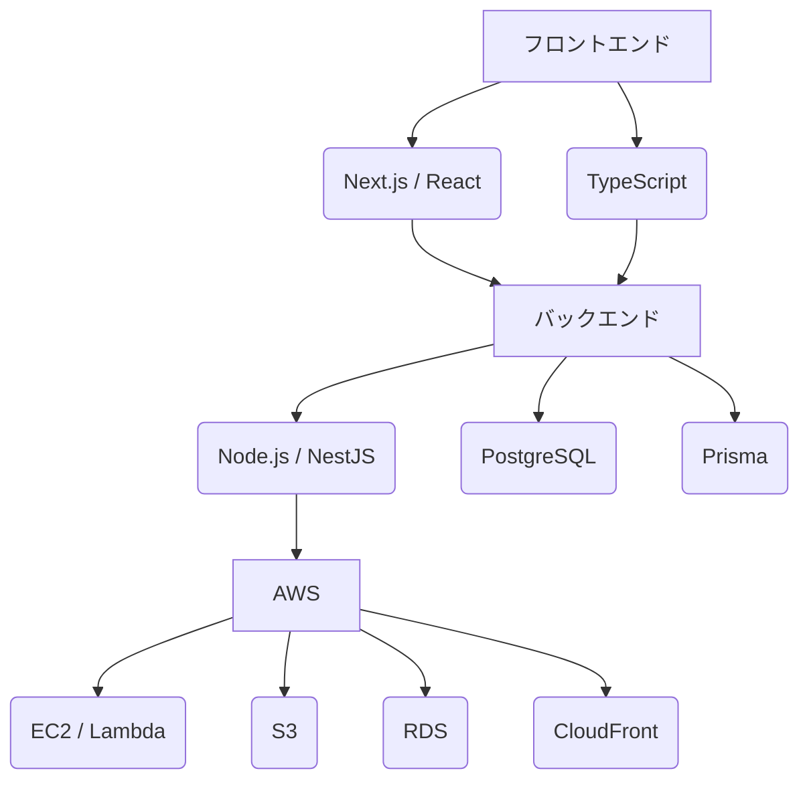

# README.md

## 1. 提案概要

この提案では、スポンサー企業と団体をマッチングするWebサービスの新規開発に向けた技術的アプローチについて説明します。MVP（初期版）の開発から継続的な機能追加・改善まで、全体的にスケーラブルで保守性の高いシステム構成を提案します。

## 2. 技術選定と理由

### 前端
- **Next.js / React**: ホットリロードやSEO対応が可能なフレームワークを使用することで、開発効率を向上させます。
- **TypeScript**: 静的型付けによりコードの品質を保ち、メンテナンス性を向上します。

### バックエンド
- **Node.js / NestJS**: 非同期処理に優れたフレームワークで、スケーラビリティとパフォーマンスを確保します。
- **PostgreSQL**: 信頼性の高いデータベースを使用することで、大量のデータ管理が可能になります。

### ORM
- **Prisma**: データモデルとデータベースとの間のマッピングを自動化し、開発効率を向上させます。

### クラウドサービス
- **AWS**: 可拡張性と信頼性が高く、コストパフォーマンスも優れています。
- **Docker**: コンテナ化により環境の一貫性を保ち、デプロイメントの容易さを向上します。

## 3. アーキテクチャ図

## 4. 開発アプローチ

1. **MVP開発**: 初期版の機能を最小限に抑え、必要な機能のみを実装します。
2. **モジュール化**: フロントエンドとバックエンドを明確なモジュールに分割し、それぞれ独立して開発・テストを行います。
3. **継続的インテグレーション/デプロイメント (CI/CD)**: GitHub ActionsやAWS CodePipelineを使用して自動化されたビルドとデプロイを行うことで、品質を保ちながら迅速なリリースが可能です。

## 5. 本提案の強み

1. **過去の実績**: 以前に同様のマッチングサービスを開発した経験があり、ユーザー認証やデータ管理のベストプラクティスを活用できます。
2. **スケーラビリティ**: AWSとDockerを使用することで、システムの拡張性が高く、将来の機能追加にも対応可能です。
3. **保守性**: TypeScriptとPrismaを使用することで、コードの品質とメンテナンス性を向上させ、長期的な運用に優れています。